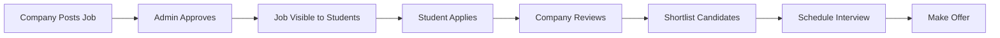

<p align="center">
  <h1 align="center">🎓 Placement Management System</h1>
  <p align="center">
    A comprehensive Django-based web application designed to streamline campus placement processes for educational institutions.
    <br />
    <a href="#-features"><strong>Explore Features »</strong></a>
    <br />
    <br />
    <a href="#-installation">Installation</a>
    ·
    <a href="https://github.com/vikram583135/placement_system/issues/new?labels=bug">Report Bug</a>
    ·
    <a href="https://github.com/vikram583135/placement_system/issues/new?labels=enhancement">Request Feature</a>
  </p>
</p>

<p align="center">
  
  
  
  
  
  
</p>

---

## 📋 Table of Contents

- [Overview](#-overview)
- [Features](#-features)
- [Technology Stack](#️-technology-stack)
- [Project Structure](#-project-structure)
- [Installation](#-installation)
- [Usage](#-usage)
- [User Roles](#-user-roles)
- [Database Models](#️-database-models)
- [API Endpoints](#-api-endpoints)
- [Contributing](#-contributing)
- [Code of Conduct](#-code-of-conduct)
- [Contributors](#-contributors)
- [License](#-license)
- [Support](#-support)

---

## 🎯 Overview

The **Placement Management System** is designed to automate and simplify the entire campus recruitment process. It provides dedicated interfaces for three types of users:

| Role | Description |
|------|-------------|
| 🎓 **Students** | Build profiles, browse jobs, apply, and track applications |
| 🏢 **Companies** | Post jobs, review applications, shortlist candidates, and schedule interviews |
| 👨‍💼 **Administrators (TPO)** | Oversee the entire ecosystem, approve jobs, manage users, and generate reports |

### Why This Project?

- 📈 **Streamlined Process**: Automates the entire placement workflow
- 🔒 **Secure**: Role-based access control with Django's authentication
- 📱 **Responsive**: Mobile-friendly Bootstrap 5 interface
- 🎨 **Modern UI**: Glassmorphism effects and intuitive design
- 🚀 **Scalable**: Easy to upgrade from SQLite to PostgreSQL/MySQL

---

## ✨ Features

### For Students
| Feature | Description |
|---------|-------------|
| ✅ Profile Management | Create and update comprehensive student profiles |
| ✅ Resume Upload | Upload and manage resumes (PDF format) |
| ✅ Job Browsing | View eligible job postings based on CGPA, branch, and backlogs |
| ✅ One-Click Applications | Apply to jobs with a single click |
| ✅ Application Tracking | Monitor status (Applied, Shortlisted, Interview, Offered, Rejected) |
| ✅ Interview Schedules | View all scheduled interviews with details |
| ✅ Placement Status | Track final placement outcome |

### For Companies
| Feature | Description |
|---------|-------------|
| ✅ Company Profile | Manage company information and branding |
| ✅ Job Posting | Create job postings with specific eligibility criteria |
| ✅ Application Management | View and filter applications by status |
| ✅ Candidate Shortlisting | Shortlist candidates for interviews |
| ✅ Interview Scheduling | Schedule interviews for shortlisted candidates |
| ✅ Offer Management | Mark candidates as offered |
| ✅ Dashboard Analytics | View recruitment statistics and metrics |

### For Administrators (TPO)
| Feature | Description |
|---------|-------------|
| ✅ Comprehensive Dashboard | Overview of entire placement ecosystem |
| ✅ User Management | Manage students and companies |
| ✅ Job Approval | Review and approve/reject job postings |
| ✅ Interview Management | Oversee all scheduled interviews |
| ✅ Analytics | View placement statistics and trends |
| ✅ Report Generation | Export data as CSV files |
| ✅ Bulk Upload | Import student/company data via CSV |
| ✅ Audit Logs | Track important system actions |

---

## 🛠️ Technology Stack

<table>
  <tr>
    <th>Category</th>
    <th>Technology</th>
  </tr>
  <tr>
    <td><b>Backend</b></td>
    <td>
      
      
    </td>
  </tr>
  <tr>
    <td><b>Database</b></td>
    <td>
      
      (Upgradable to PostgreSQL/MySQL)
    </td>
  </tr>
  <tr>
    <td><b>Frontend</b></td>
    <td>
      
      
    </td>
  </tr>
  <tr>
    <td><b>Forms</b></td>
    <td>Django Crispy Forms with Bootstrap 5</td>
  </tr>
  <tr>
    <td><b>Authentication</b></td>
    <td>Django's built-in auth with custom User model</td>
  </tr>
</table>

---

## 📁 Project Structure

```
placement-management-system-project/
│
├── 📂 core/                           # Main application
│   ├── 📂 migrations/                 # Database migrations
│   ├── 📂 management/                 # Custom management commands
│   ├── 📂 templates/                  # HTML templates
│   │   ├── 📂 admin/                  # Admin panel templates
│   │   ├── 📂 company/                # Company panel templates
│   │   ├── 📂 student/                # Student panel templates
│   │   ├── 📂 registration/           # Auth templates
│   │   ├── 📂 partials/               # Reusable components
│   │   └── 📂 utils/                  # Utility templates
│   │
│   ├── 📄 models.py                   # Database models
│   ├── 📄 views.py                    # View functions
│   ├── 📄 urls.py                     # URL routing
│   ├── 📄 forms.py                    # Django forms
│   ├── 📄 decorators.py               # Custom decorators
│   └── 📄 context_processors.py       # Custom context processors
│
├── 📂 placement_system/               # Project configuration
│   ├── 📄 settings.py                 # Project settings
│   ├── 📄 urls.py                     # Root URL configuration
│   ├── 📄 wsgi.py                     # WSGI configuration
│   └── 📄 asgi.py                     # ASGI configuration
│
├── 📂 static/                         # Static files (CSS, JS, images)
├── 📂 media/                          # User-uploaded files (gitignored)
├── 📄 manage.py                       # Django management script
├── 📄 requirements.txt                # Python dependencies
└── 📄 README.md                       # This file
```

---

## 🚀 Installation

### Prerequisites

- **Python** 3.8 or higher
- **pip** (Python package manager)
- **Git**

### Quick Start

```bash
# 1. Clone the repository
git clone https://github.com/vikram583135/placement_system.git
cd placement-management-system-project

# 2. Create a virtual environment
python -m venv venv

# 3. Activate virtual environment
# Windows:
venv\Scripts\activate
# macOS/Linux:
source venv/bin/activate

# 4. Install dependencies
pip install -r requirements.txt

# 5. Apply database migrations
python manage.py migrate

# 6. Create a superuser (Admin)
python manage.py createsuperuser

# 7. Run the development server
python manage.py runserver

# 8. Open your browser
# Application: http://127.0.0.1:8000/
# Admin Panel: http://127.0.0.1:8000/admin/
```

---

## 📖 Usage

### Workflow



### Quick Reference

| Action | Student | Company | Admin |
|--------|---------|---------|-------|
| Register | `/register/student/` | `/register/company/` | Django Admin |
| Dashboard | `/student/dashboard/` | `/company/dashboard/` | `/tpo/dashboard/` |
| Profile | `/student/profile/` | `/company/profile/` | - |
| Jobs | `/student/jobs/` | `/company/jobs/manage/` | `/tpo/jobs/approve/` |

---

## 👥 User Roles

| Role | Access Level | Key Capabilities |
|------|--------------|------------------|
| 🎓 **Student** | Student dashboard, profile, jobs | Apply to jobs, upload resume, track applications |
| 🏢 **Company** | Company dashboard, job management | Post jobs, review candidates, schedule interviews |
| 👨‍💼 **Admin (TPO)** | Full system access | Manage users, approve jobs, generate reports |

---

## 🗄️ Database Models

| Model | Description |
|-------|-------------|
| **User** | Custom user model with role field (admin/student/company) |
| **StudentProfile** | Student details, academics, resume, placement status |
| **CompanyProfile** | Company info, HR details, approval status |
| **JobPosting** | Job details, eligibility criteria, deadlines |
| **Application** | Links students to jobs with status tracking |
| **InterviewSchedule** | Interview details, mode, venue/link |
| **Document** | Admin-uploaded guidelines and templates |
| **AuditLog** | System action tracking for accountability |

---

## 📊 API Endpoints

### Authentication
| Method | Endpoint | Description |
|--------|----------|-------------|
| GET/POST | `/register/student/` | Student registration |
| GET/POST | `/register/company/` | Company registration |
| GET/POST | `/login/` | User login |
| GET | `/logout/` | User logout |

### Student Panel
| Method | Endpoint | Description |
|--------|----------|-------------|
| GET | `/student/dashboard/` | Dashboard overview |
| GET/POST | `/student/profile/` | Profile management |
| GET | `/student/jobs/` | Browse job listings |
| GET | `/student/applied-jobs/` | View applications |
| GET | `/student/interviews/` | Interview schedule |

### Company Panel
| Method | Endpoint | Description |
|--------|----------|-------------|
| GET | `/company/dashboard/` | Dashboard overview |
| GET/POST | `/company/profile/` | Company profile |
| GET/POST | `/company/jobs/post/` | Post new job |
| GET | `/company/jobs/manage/` | Manage jobs |
| GET | `/company/jobs/<id>/applicants/` | View applicants |

### Admin Panel
| Method | Endpoint | Description |
|--------|----------|-------------|
| GET | `/tpo/dashboard/` | Admin dashboard |
| GET | `/tpo/students/` | Manage students |
| GET | `/tpo/companies/` | Manage companies |
| GET | `/tpo/jobs/approve/` | Approve jobs |
| GET | `/tpo/analytics/` | View analytics |
| GET | `/tpo/reports/` | Generate reports |

---

## 🤝 Contributing

We love contributions! This project is **open for contributions** from developers of all skill levels. Whether you're fixing bugs, adding features, or improving documentation, your help is welcome!

### How to Contribute

1. **🍴 Fork the repository**
   ```bash
   # Click the 'Fork' button on GitHub, then clone your fork
   git clone https://github.com/YOUR_USERNAME/placement_system.git
   cd placement-management-system-project
   ```

2. **🌿 Create a feature branch**
   ```bash
   git checkout -b feature/your-feature-name
   # or for bug fixes:
   git checkout -b fix/bug-description
   ```

3. **💻 Make your changes**
   - Write clean, documented code
   - Follow PEP 8 style guidelines for Python
   - Add comments for complex logic
   - Update documentation if needed

4. **✅ Test your changes**
   ```bash
   python manage.py test
   ```

5. **📝 Commit your changes**
   ```bash
   git add .
   git commit -m "feat: add your feature description"
   # Use conventional commits: feat, fix, docs, style, refactor, test, chore
   ```

6. **🚀 Push to your fork**
   ```bash
   git push origin feature/your-feature-name
   ```

7. **🔃 Open a Pull Request**
   - Go to the original repository on GitHub
   - Click "New Pull Request"
   - Select your feature branch
   - Fill out the PR template with details about your changes

### Contribution Guidelines

#### 📋 Before You Start
- Check existing [issues](https://github.com/vikram583135/placement_system/issues) to avoid duplicate work
- For major changes, open an issue first to discuss your proposal
- Look for issues labeled `good first issue` if you're new to the project

#### 🎯 What We're Looking For
- 🐛 **Bug fixes** - Help us squash bugs!
- ✨ **New features** - Check our [Future Enhancements](#-future-enhancements)
- 📚 **Documentation** - Improve README, add comments, create guides
- 🧪 **Tests** - Add unit tests, integration tests
- 🎨 **UI/UX improvements** - Make the interface even better
- ⚡ **Performance** - Optimize queries, reduce load times
- 🌐 **Translations** - Help make the app multilingual

#### 💡 Good First Issues

New to open source? Look for issues tagged with:
- `good first issue` - Great for beginners
- `help wanted` - We need your help!
- `documentation` - No coding required

#### 📏 Code Style

- **Python**: Follow [PEP 8](https://pep8.org/) guidelines
- **Django**: Follow [Django coding style](https://docs.djangoproject.com/en/dev/internals/contributing/writing-code/coding-style/)
- **HTML/CSS**: Use consistent indentation (2 spaces)
- **Commits**: Use [Conventional Commits](https://www.conventionalcommits.org/)

### 🏆 Recognition

All contributors will be:
- Added to the [Contributors](#-contributors) section
- Mentioned in release notes for significant contributions
- Part of our amazing open-source community!

---

## 📜 Code of Conduct

We are committed to providing a welcoming and inclusive environment. Please read and follow our code of conduct:

### Our Pledge

- Be respectful and inclusive
- Welcome newcomers and help them learn
- Focus on what's best for the community
- Show empathy towards other community members

### Unacceptable Behavior

- Harassment, discrimination, or trolling
- Personal or political attacks
- Publishing others' private information
- Other conduct which could be considered inappropriate

### Enforcement

Violations may result in temporary or permanent bans from the community. Report issues to the project maintainers.

---

## 🌟 Contributors

Thanks goes to these wonderful people:

<!-- ALL-CONTRIBUTORS-LIST:START -->
<table>
  <tr>
    <td align="center">
      <a href="https://github.com/vikram583135">
        
        <br />
        <sub><b>Vikram</b></sub>
      </a>
      <br />
      💻 📖 🎨
    </td>
    <!-- Add more contributors here -->
  </tr>
</table>
<!-- ALL-CONTRIBUTORS-LIST:END -->

Want to see your face here? [Start contributing!](#-contributing)

---

## 📈 Future Enhancements

We're actively looking for contributors to help with these features:

- [ ] 📧 Email notifications for application status updates
- [ ] 💬 Real-time chat between students and companies
- [ ] 📊 Advanced analytics with charts and graphs (Chart.js/D3.js)
- [ ] 📱 Mobile application (React Native/Flutter)
- [ ] 🔗 Integration with LinkedIn for profile import
- [ ] 🎥 Video interview scheduling
- [ ] 📄 Automated resume parsing with AI
- [ ] 🌐 Multi-language support (i18n)
- [ ] 🔌 REST API for third-party integrations
- [ ] 🔔 Push notifications
- [ ] 📅 Calendar integration (Google Calendar, Outlook)
- [ ] 📈 Placement prediction using ML

**Interested in working on any of these?** Open an issue to discuss!

---

## 🔒 Security

- **Role-Based Access Control**: Custom decorators ensure authorized access
- **CSRF Protection**: Django's built-in CSRF protection
- **Password Validation**: Strong password requirements
- **File Upload Validation**: Restricted file types
- **SQL Injection Protection**: Django ORM prevents attacks

### Reporting Security Issues

Found a security vulnerability? Please email the maintainers directly instead of opening a public issue.

---

## 📝 License

This project is licensed under the **MIT License** - see the [LICENSE](LICENSE) file for details.

```
MIT License

Copyright (c) 2025 Placement Management System

Permission is hereby granted, free of charge, to any person obtaining a copy
of this software and associated documentation files (the "Software"), to deal
in the Software without restriction, including without limitation the rights
to use, copy, modify, merge, publish, distribute, sublicense, and/or sell
copies of the Software, and to permit persons to whom the Software is
furnished to do so, subject to the following conditions:

The above copyright notice and this permission notice shall be included in all
copies or substantial portions of the Software.
```

---

## 📞 Support

Need help? We've got you covered!

| Channel | Link |
|---------|------|
| 🐛 **Bug Reports** | [Open an Issue](https://github.com/vikram583135/placement_system/issues/new?labels=bug) |
| 💡 **Feature Requests** | [Open an Issue](https://github.com/vikram583135/placement_system/issues/new?labels=enhancement) |
| 💬 **Discussions** | [GitHub Discussions](https://github.com/vikram583135/placement_system/discussions) |
| 📧 **Email** | Contact the maintainers |

---

## ⭐ Star History

If you find this project useful, please consider giving it a ⭐ on GitHub! It helps others discover the project and motivates us to keep improving.

---

<p align="center">
  <b>Made with ❤️ for streamlining campus placements</b>
  <br />
  <br />
  <a href="#-placement-management-system">Back to Top ↑</a>
</p>

---

> **Note**: This is a development version. For production deployment, ensure proper security configurations, use a production-grade database (PostgreSQL/MySQL), and set up proper static file serving with Nginx or Apache.
